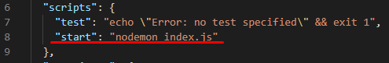

**[Swagger]** - фреймворк для описания REST API.

**[Swagger-Editor]** - онлайн-редактор, который проверяет документацию на соответствие правилам спецификации [OpenAPI], помечает ошибки и дает советы по форматированию.

**[Правила-спецификации-OpenAPI]**

---

## APP - Automatic Swagger Documentation with Express - JSDoc (см. директорию app-1)

1. Создаем новый проект `npm init` - в результате получаем package.json файл.    

2. Устанавливаем необходимые зависимости `npm i --save swagger-jsdoc swagger-ui-express express nodemon`:

- **[swagger-jsdoc]** - использует [JSDoc]-комментарии для создания swagger-спецификации.       
- **[swagger-ui-express]** - читает swagger-спецификацию, созданную с помощью *swagger-jsdoc*, и создает Swagger UI.
    
3. Проблемы с версиями "swagger-jsdoc" и Node.js >= v13

При использовании "swagger-jsdoc" версии "^4.0.0" - подключение модулей внутри *index.js* необходимо выполнять с помощью require:
```js
const express = require("express");
const swaggerJsDoc = require("swagger-jsdoc");
const swaggerUI = require("swagger-ui-express");
```

При использовании "swagger-jsdoc" версии "^7.0.0-rc.2" - подключение модулей внутри *index.js* необходимо выполнять с помощью import:
```js
import express from "express";
import swaggerJsDoc from "swagger-jsdoc";
import swaggerUI from "swagger-ui-express";
```
Для подключения модулей с помощью import, внутрь *package.json* необходимо добавить поле `"type": "module"`

4. Добавляем команду для запуска приложения:   


5. Описание работы со swagger см. index.js.

6. Выполняем `npm start` и переходим на http://localhost:5000/api-docs
---

[Swagger]: <https://swagger.io/>
[Swagger-Editor]: <https://editor.swagger.io/?_ga=2.75713237.1147543011.1614264746-2111772626.1614105641>
[Правила-спецификации-OpenAPI]: <https://swagger.io/docs/specification/basic-structure/>
[OpenAPI]: <https://ru.wikipedia.org/wiki/OpenAPI_(%D1%81%D0%BF%D0%B5%D1%86%D0%B8%D1%84%D0%B8%D0%BA%D0%B0%D1%86%D0%B8%D1%8F)>
[JSDoc]: <https://jsdoc.app/>
[swagger-jsdoc]: <https://www.npmjs.com/package/swagger-jsdoc>
[swagger-ui-express]: <https://www.npmjs.com/package/swagger-ui-express>
