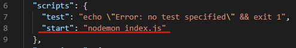

**[Swagger]** - фреймворк для описания REST API.

**[Swagger-Editor]** - онлайн-редактор, который проверяет документацию на соответствие правилам спецификации [OpenAPI], помечает ошибки и дает советы по форматированию.

**[Правила-спецификации-OpenAPI]**

---

## APP - Automatic Swagger Documentation with Express - JSON (см. директорию app-2)

1. Создаем новый проект `npm init` - в результате получаем package.json файл.    

2. Устанавливаем необходимые зависимости `npm i --save swagger-ui-express express nodemon`:
     
- **[swagger-ui-express]** - читает swagger-спецификацию из файла *swagger.json* и создает Swagger UI.
    
3. Добавляем команду для запуска приложения:   

4. Создаем swagger-спецификацию - *swagger.json*.

5. Подключаем swagger - *index.js*.

6. Выполняем `npm start` и переходим на http://localhost:5000/api-docs
---

[Swagger]: <https://swagger.io/>
[Swagger-Editor]: <https://editor.swagger.io/?_ga=2.75713237.1147543011.1614264746-2111772626.1614105641>
[Правила-спецификации-OpenAPI]: <https://swagger.io/docs/specification/basic-structure/>
[OpenAPI]: <https://ru.wikipedia.org/wiki/OpenAPI_(%D1%81%D0%BF%D0%B5%D1%86%D0%B8%D1%84%D0%B8%D0%BA%D0%B0%D1%86%D0%B8%D1%8F)>
[swagger-ui-express]: <https://www.npmjs.com/package/swagger-ui-express>
